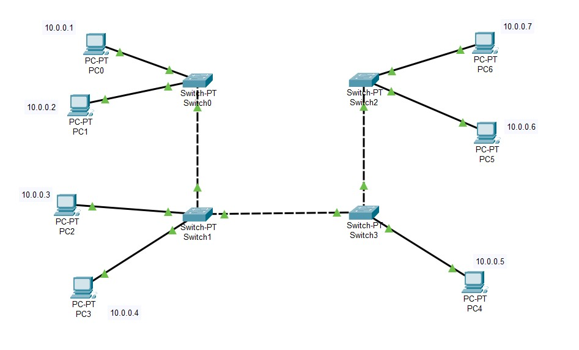
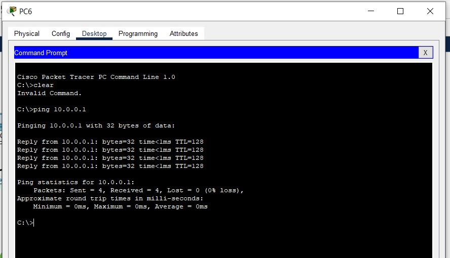
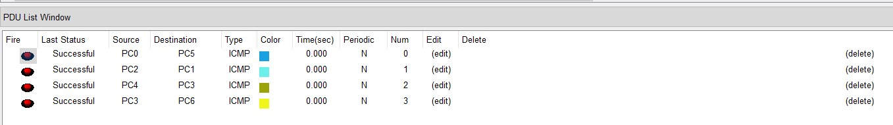
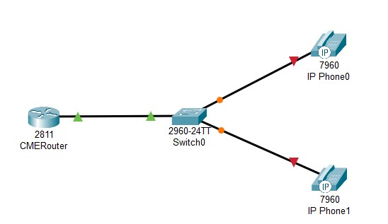
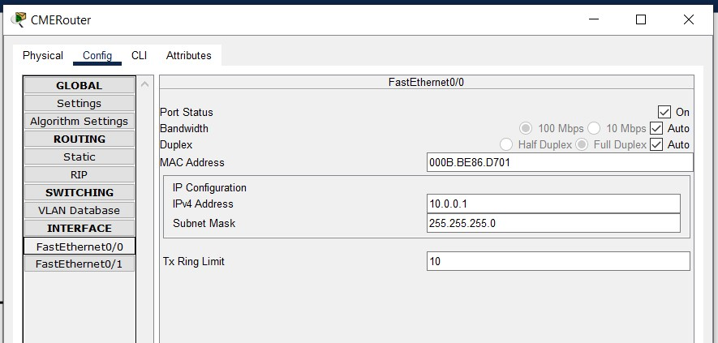
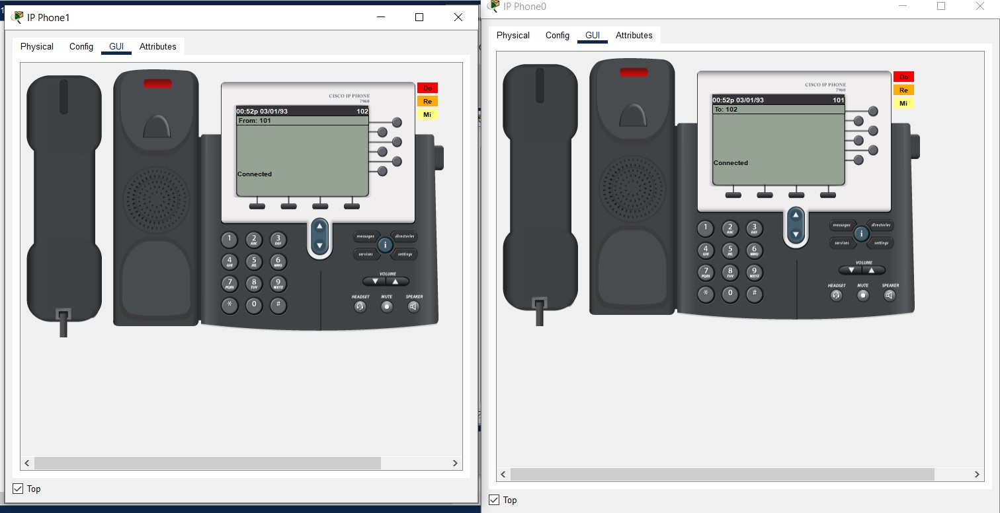
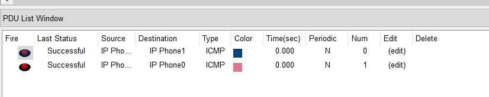

University: ITMO University

Faculty: PIn

Course: IP-telephony

Year: 2024/2025

Group: K34202

Author: Shalyapina Maria Vasilievna

Lab: Lab1

Date of create: 04.03.2025

Date of finished: 04.03.2025

# Лабораторная работа №1 "Базовая настройка ip-телефонов в среде Сisco packet tracer"

## Описание
Для выполнения данной лабораторной работы собирается схема соединения. Необходимо проверить, правильно ли подключены и настроены все узлы устройств.

## Цель работы
Изучить рабочую среду Cisco Packet Tracer, ознакомить- ся с интерфейсами основных устройств, типами кабелей, научиться собирать топологию. Изучить построение сети IP-телефонии с помощью маршрутизатора, коммутатора и IP телефонов Cisco 7960 в среде Packet tracer

## Ход выполнения работы

### Часть 1

1. В Cisco Packet Tracer собираем схему соединения, размещаем четыре коммутатора, семь компьютеров и подключаем их



2. Для каждого ПК прописываем IP-адрес, я выбрала сеть 10.0.0.0/24

3. Все компьютеры находятся в одной подсети, поэтому можем пинговать их между собой





### Часть 2

1. Размещаем маршрутизатор, коммутатор и два IP-телефона, подключаем их



2. На роутере назначаем интерфейсу Fa0/0 ip-адрес 10.0.0.1 и включаем его



3. Далее пропишем dhcp pool адресов для наших телефонов
```
CMERouter(config)#ip dhcp pool VoIP
CMERouter(dhcp-config)#network 10.0.0.0 255.255.255.0
CMERouter(dhcp-config)#def
CMERouter(dhcp-config)#default-router 10.0.0.1
CMERouter(dhcp-config)#option 150 ip 10.0.0.1
CMERouter(dhcp-config)#exit
```
4. Теперь настроим работу телефонного сервиса. Указываем максимальное количество телефонов и линий, интерфейс и порт, присвоение линий в автоматическом режиме
```
CMERouter(config)#telephony-service 
CMERouter(config-telephony)#max-ephones 5
CMERouter(config-telephony)#max-dn 5
CMERouter(config-telephony)#ip source-address 10.0.0.1 port 2000
CMERouter(config-telephony)#auto assign 1 to 5
CMERouter(config-telephony)#exit
```

5. Присвоим номера нашим телефонам
```
CMERouter(config)#ephone-dn 1
CMERouter(config-ephone-dn)#%LINK-3-UPDOWN: Interface ephone_dsp DN 1.1, changed state to up

CMERouter(config-ephone-dn)#number 101
CMERouter(config-ephone-dn)#exit
CMERouter(config)#ephone-dn 2
CMERouter(config-ephone-dn)#%LINK-3-UPDOWN: Interface ephone_dsp DN 2.1, changed state to up

CMERouter(config-ephone-dn)#number 102
CMERouter(config-ephone-dn)#exit
```

6. Далее на коммутаторе нужно выбрать интерфейсы, к которым подключены роутер и телефоны, перевести их в режим access и указать голосовой vlan
```
Switch(config)#int range Fa0/1-3
Switch(config-if-range)#switchport mode access 
Switch(config-if-range)#switchport voice vlan 1
```

7. Включаем телефоны, ждем, пока они получат свои номера, и можно звонить





## Выводы
В ходе выполнения практического задания была настроена работа простой схемы подключения с L2-коммутаторами и работа IP-телефонии. 


