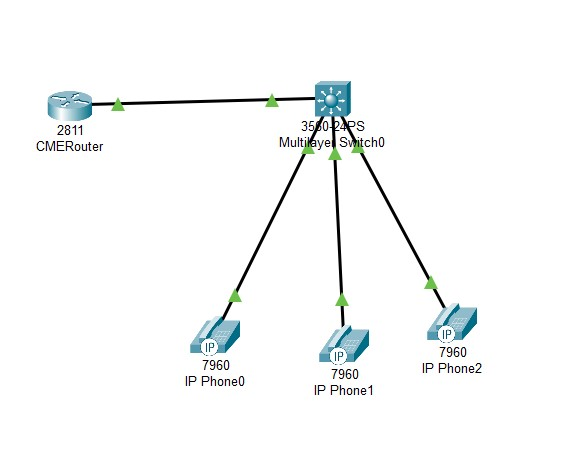
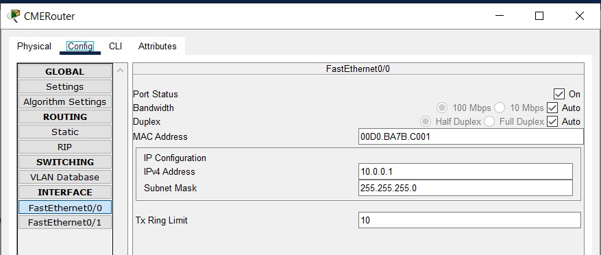
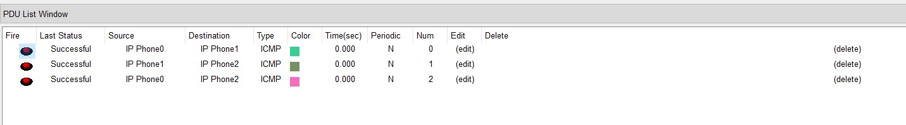

University: ITMO University

Faculty: PIn

Course: IP-telephony

Year: 2024/2025

Group: K34202

Author: Shalyapina Maria Vasilievna

Lab: Lab2

Date of create: 04.03.2025

Date of finished: 04.03.2025

# Лабораторная работа №2 "Конфигурация voip в среде Сisco packet tracer"

## Описание
Для выполнения данной лабораторной работы собирается схема соединения. Необходимо проверить, правильно ли подключены все узлы устройств. Предварительно удалить все преды- дущие конфигурационные файлы на маршрутизаторах Cisco 2811, на коммутаторе Cisco catalyst 3560.

## Цель работы
Изучить построение сети IP-телефонии с помощью маршрутизатора Cisco 2811, коммутатора Cisco catalyst 3560 и IP телефонов Cisco 7960.

## Ход выполнения работы

### Часть 1

1. В Cisco Packet Tracer собираем схему соединения, согласно заданию



2. На маршрутизаторе отключаем DNS lookup и задаем пароли для защиты доступа к консоли локально и удаленно

```
CMERouter(config)#no ip domain-lookup
CMERouter(config)#enable secret cisco
CMERouter(config)#line console 0
CMERouter(config-line)#password cisco
CMERouter(config-line)#login
CMERouter(config-line)#exit
CMERouter(config)#line vty 0 4
CMERouter(config-line)#password cisco
CMERouter(config-line)#login
CMERouter(config-line)#exit
```

3. На роутере присвоим ip-адрес интерфейсу Fa0/0



4. Настроим DHCP и передачу голоса аналогично прошлой лабораторной работе, присвоим номера телефонам
```
CMERouter(config)#ip dhcp pool VoIP
CMERouter(dhcp-config)#network 10.0.0.0 255.255.255.0
CMERouter(dhcp-config)#def
CMERouter(dhcp-config)#default-router 10.0.0.1
CMERouter(dhcp-config)#option 150 ip 10.0.0.1
CMERouter(dhcp-config)#exit
CMERouter(config)#telephony-service 
CMERouter(config-telephony)#max-ephones 5
CMERouter(config-telephony)#max-dn 5
CMERouter(config-telephony)#ip source-address 10.0.0.1 port 2000
CMERouter(config-telephony)#auto assign 1 to 5
CMERouter(config-telephony)#exit
```

5. На коммутаторе указываем голосовой vlan
```
Switch(config)#int range Fa0/1-4
Switch(config-if-range)#switchport voice vlan 1
```

6. Подключаем телефоны и проверяем связность


   
### Часть 2


## Выводы
