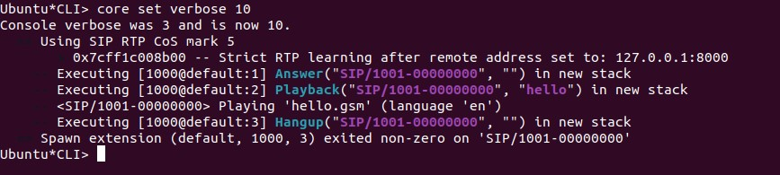

University: ITMO University

Faculty: PIn

Course: IP-telephony

Year: 2024/2025

Group: K34202

Author: Shalyapina Maria Vasilievna

Lab: Lab3

Date of create: 10.04.2025

Date of finished: 10.04.2025

# Лабораторная работа №3 "Использование Asterisk в качестве SIP proxy"

## Описание
Для выполнения данной лабораторной работы необходимо выполнить настройку Asterisk.

## Цель работы
Изучить программный комплекс Asterisk. Настройка Asterisk для локальных звонков.

## Ход выполнения работы

### Часть 1

1. По умолчанию Aterisk предназначен для Linux-систем, поэтому работу я выполняла на виртуальной машине с ОС Ubuntu. Для установки Asterisk выполняем команды
```
sudo apt-get update
sudo apt-get install asterisk
```

2. После того, как  Asterisk установлен, приступаем к редактированию конфигурационных файлов.

Для настройки SIP-каналов нужно отредактировать файл sip.conf

Чтобы было удобнее работать, я создала копию этого файла sip.conf_back, а сам sip.conf очистила и прописала в нем только два SIP-пользователя с номерами 1000 и 1001. ```type=friend``` позволяет инициировать вызов как с клиента, так и на него; ```context=default``` определяет правила обработки вызова для этого пользователя (прописываются дальше в файле extensions.conf); ```secret=lab3``` - пароль, который будет использоваться при регистрации пользователя; ```host=dynamic``` позволяет пользователю регистрироваться с любого, заранее неизвестного IP-адреса.
```bash
[1000]
type=friend
context=default
secret=lab3
host=dynamic

[1001]
type=friend
context=default
secret=lab3
host=dynamic
```
Аналогично я сделала копию extensions.conf и продолжила работу уже с пустым файлом. В нем нужно прописать раннее заданное правило default. Здесь при вызове номера 1000 будет проигрываться запись hello.gsm, после чего вызов завершится

```
[default]
exten => 1000,1,Answer()
exten => 1000,2,Playback(hello-world)
exten => 1000,3,Hangup()

exten => 1001,1,Dial(SIP/1001)
```

3. Теперь установим софтфон Twinkle - свободное программное обеспечение для совершения голосовых вызовов (VoIP) в IP-сетях. Открываем приложение и создаем два профиля - 1000 и 1001. В качестве SIP-сервера указываю 127.0.0.1, так как Asterisk установлен на этом же хосте. По той же причине я поменяла порт для SIP-вызовов в Twinkle на 5070, так как стандартный 5060 уже занят Астериском

При активации профилей они автоматически регистрируются


Прежде чем совершать вызов я открыла консоль Asterisk и ввела команду ```core set verbose 10```, чтобы отследить выполнение вызова на сервере. В Twinkle выбираем пользователя 1001, в поле Call вводим 1000 и звоним. В консоли Asterisk отображается входящий вызов и шаги, которые для него выполняются в соответствии с правилом default: ответ, проигрывание записи hello и сброс звонка 



Попробуем позвонить с номера 1000 на 1001. Так как действия были прописаны только для вызова на номер 1000, сервер просто пытается соединить клиента 1000 с запрошенным 1001


## Выводы
В ходе выполнения лабораторной работы были установлены и настроены программный сервер телефонии Asterisk и софтфон Twinkle. Было создано два пользователя с номерами 1000 и 1001, регистрация пользователей на сервере и вызовы прошли успешно.
